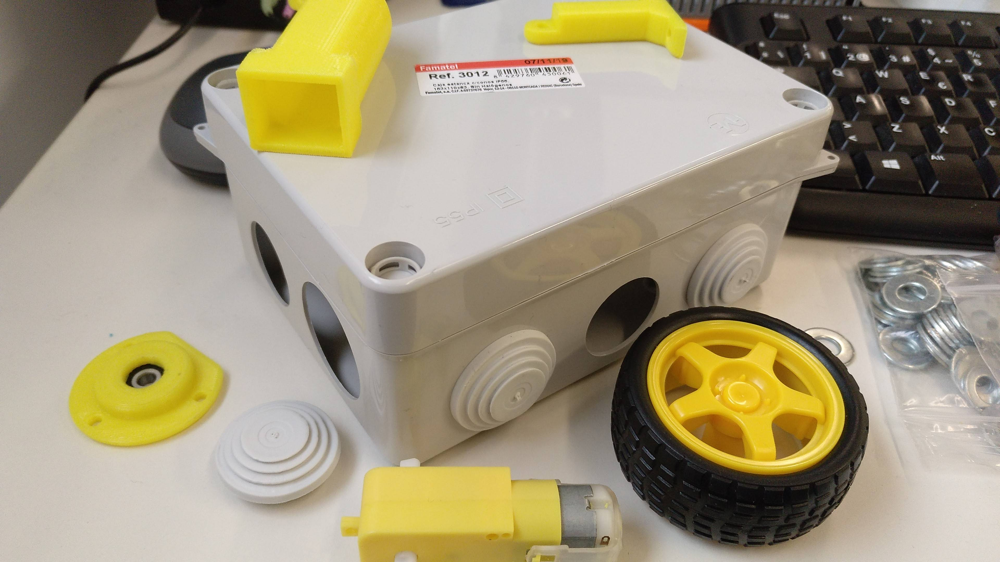
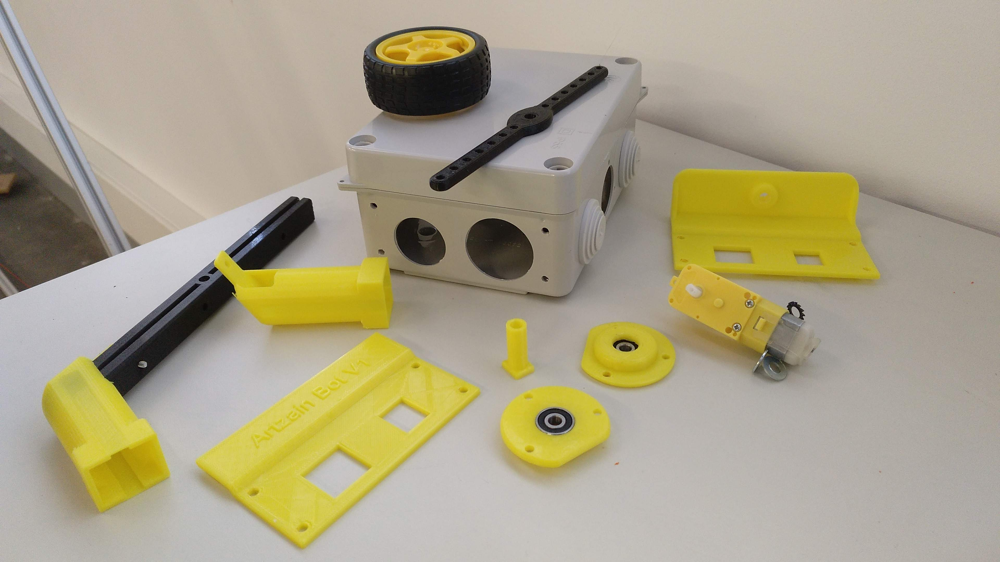

# Montaje de Artzain-Bot V1

Imprimimos las piezas de la carpeta STLs. Para ir a juego con el bloque de motor-rueda que son amarillo y negro las he hecho tambien en PLA amarillo y negro. Combina bien con el color de la caja que es gris.

La caja es de 11x15cm y de categoría IP55. Con esta foto nos hacemos idea de su tamaño. Tiene unos agujeros pasantes con unas piezas flexibles que se pueden retirar facilmente. Sirven para paso de cableado y en nuestro caso para fijar los dos ejes de las ruedas.

Aqui vemos algunas de las piezas antes de montar..

#EN CONSTRUCCION

