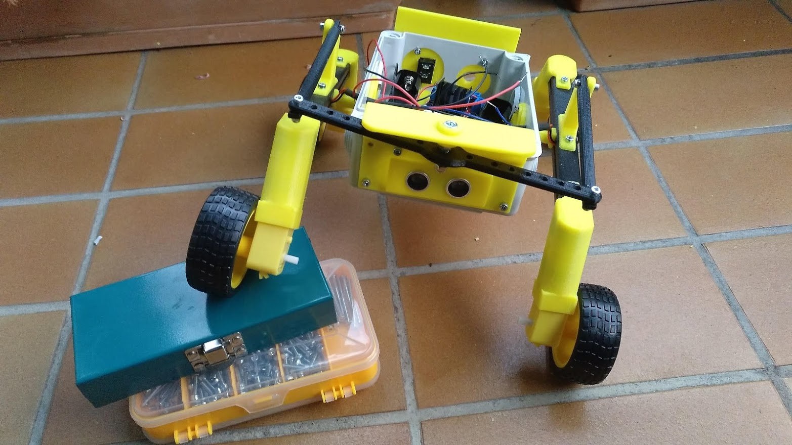

# Artzain-Bot V1

## Un robot-pastor todoterreno y de bajo coste

## Características principales:

Esta es mi primera incursión en la robótica. Me gusta ponerme objetivos concretos y que el proyecto tenga una utilidad práctica. Por ello, el objetivo para esta primera version es un **UGV (Unmanned Ground Vehicle)** pequeño y de bajo coste, con capacidad todoterreno. Está inspirado en los rover marcianos o sus equivalentes opensource como **Sawppy**.

Los rover marcianos trabajan con 6 ruedas motrices y un tipo de suspension conocida como **Rocker-Boogie** . Me parecía demasiado complejo empezar por ahí, buscando otras alternativas he visto y me ha inspirado un proyecto llamado **Leorover** (links mas abajo).

**Artzain-Bot** tiene un cuerpo liviano impreso en 3D junto a una caja de registro eléctrica de 11x15 cm. El diseño del concepto, chasis y piezas es mío, mientras que para la electrónica he confiado en la plataforma OpenBot. Otras caracteristicas son:

- 4 ruedas motrices
- Puente H basado en L298 para pilotar los motores
- Arduino Nano
- Sensor de ultrasonidos
- Alimentacion de motores mediante dos baterías 18650 en serie
- Viejo Smartphone sin SIM conectado al Arduino que mediante cable OTG proporciona alimentacion e "Inteligencia"

Para la parte de control estuve barajando 3 opciones:
- Plataforma Piborg (basada en R-Pi)
- Plataforma basada en Jetson Nano
- Plataforma OpenBot

Despues de darle bastante vueltas me he decantado por OpenBot. Aunque tengo un Jetson Nano he preferido guardarlo para un proyecto de mas calibre. No cabía bien en el chasis de OpenBot e iba a tener problemas con la disipación de calor ya que las piezas impresas son de PLA y se pueden deformar.

**OpenBot** se compone de un firmware instalado en el Arduino Nano y de una app Android instalado en el smartphone que comunica con el Nano a traves del puerto USB. Utiliza el framework **TensorFlow Lite** para controlar el robot, pudiendo ser controlado desde otro smartphone en manos del usuario. Lleva paquetes instalados para "navegar" de forma autónoma esquivando objetos que detecta mediante la cámara del móvil. Existe otro modo que permite seguir a una persona.

Se puede "entrenar" al sistema para que haga otras cosas. Asi pues, este proyecto me sirve para experimentar y valorar otros proyectos potencialmente interesantes.

Como objetivo último sería la construcción de un UGV muy robusto y con una alta capacidad para moverse de forma autónoma, que pueda transportar algunos objetos y acompañar al usuario en una parcela, hacer llamadas de emergencia en caso de problemas y otras cosas.

## Lista de componentes (BOM):

El **BOM (Bill of Materials)** está en formato de hoja de calculo Libreoffice y está todavía en construcción.

El enlace lo tienes [aquí](BOM.xlsx):

## Créditos

**Artzain-Bot** es un concepto creado por **Victor Barahona** de **[Egokitek](https://www.egokitek.com/)**.

Este proyecto se ha basado en los rover marcianos como **[Curiosity](https://es.wikipedia.org/wiki/Curiosity)** y diversos UGV de uso en la Tierra, particularmente **[Leorover](https://www.leorover.tech/)** .

## Licencia

**GPL3.0**

